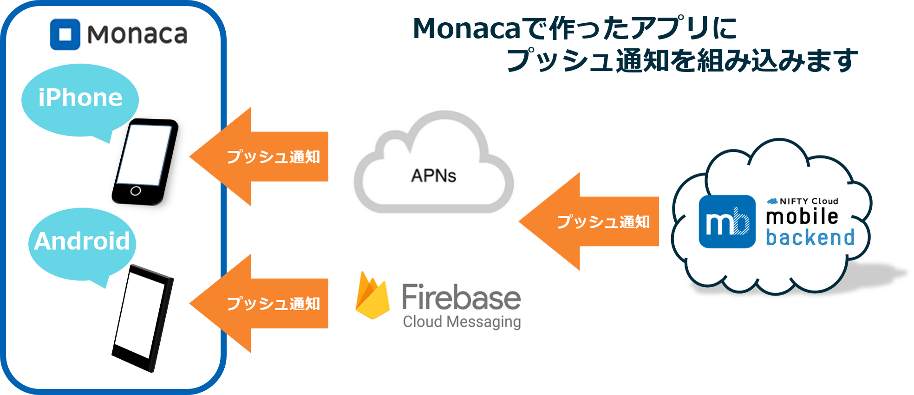
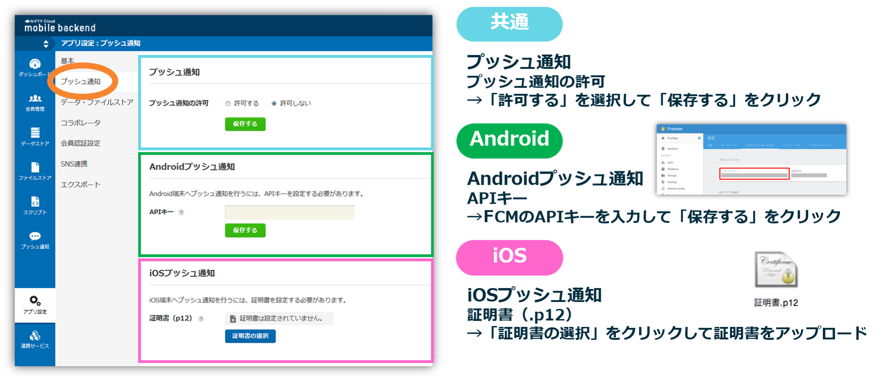
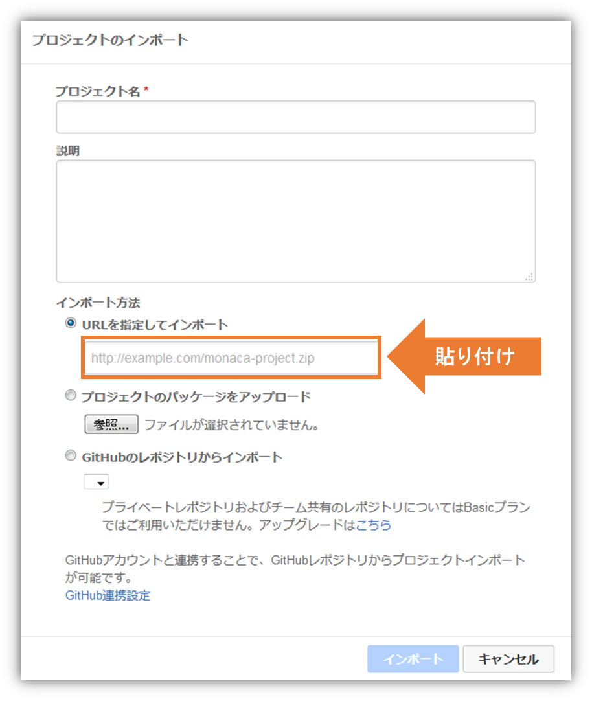
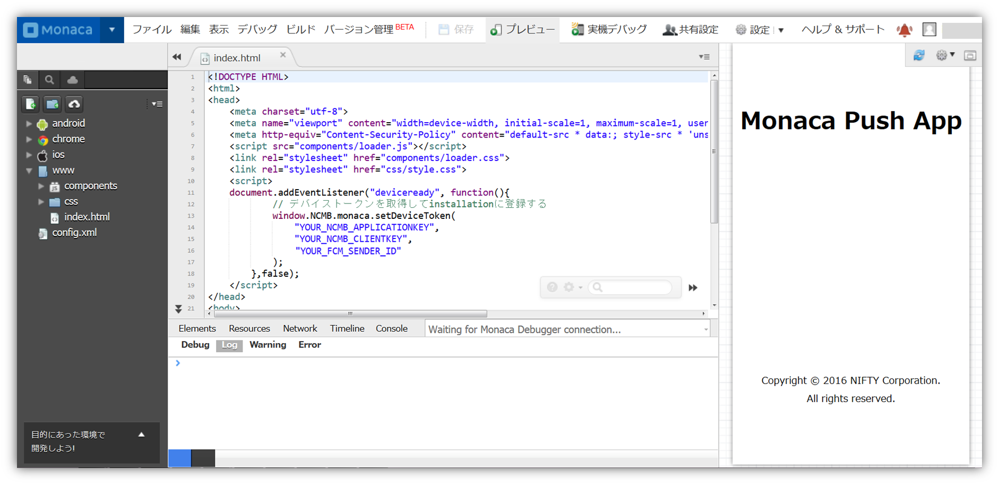
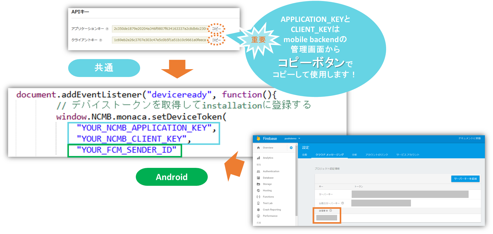
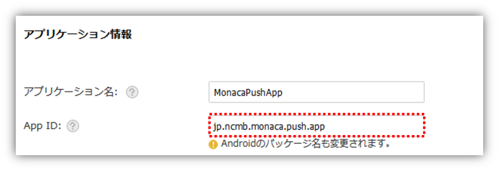
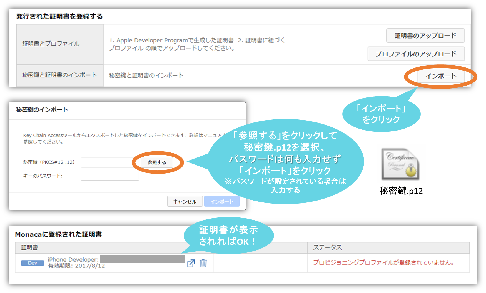
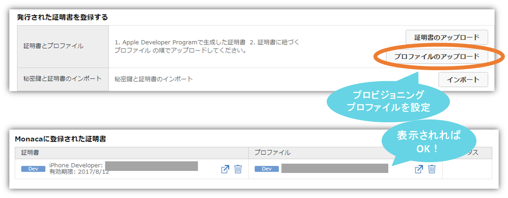
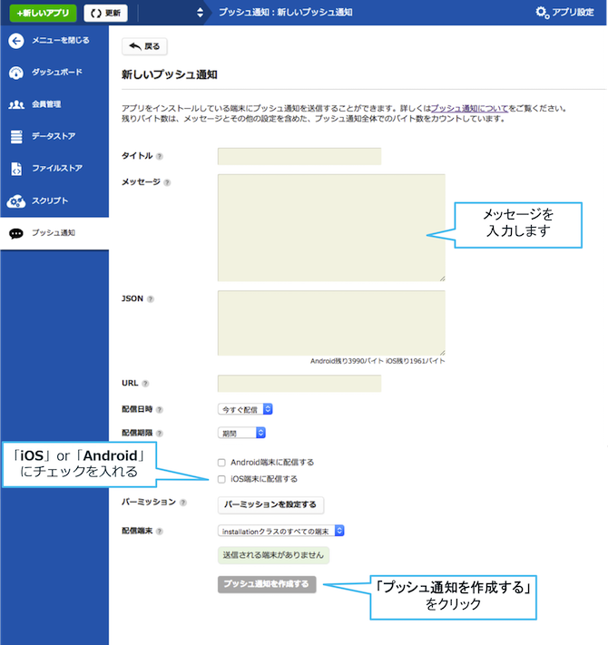
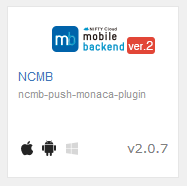

# <small>【Monaca】<br>アプリにプッシュ通知を組み込もう！</small>

<center></center>

## 概要
* [ニフティクラウドmobile backend](http://mb.cloud.nifty.com/)の『プッシュ通知』機能を実装したサンプルプロジェクトです
* 簡単な操作ですぐに [ニフティクラウドmobile backend](http://mb.cloud.nifty.com/)の機能を体験いただけます★☆

## ニフティクラウドmobile backendとは
スマートフォンアプリのバックエンド機能（プッシュ通知・データストア・会員管理・ファイルストア・SNS連携・位置情報検索・スクリプト）が**開発不要**、しかも基本**無料**(注1)で使えるクラウドサービス！

<center></center>

注1：詳しくは[こちら](http://mb.cloud.nifty.com/price.htm)をご覧ください

<div style="page-break-before:always"></div>

## 動作環境の準備
### 共通
* Monaca 会員登録
  * 下記リンクより登録（無料）をお願いします<br>https://ja.monaca.io/
* ニフティクラウド mobile backend 会員登録
  * 下記リンクより登録（無料）をお願いします<br>http://mb.cloud.nifty.com/
* 推奨ブラウザ環境の準備
 * Chrome最新版

### Android端末で動作確認をする場合
* PC
* Googleアカウント
* Android端末（最新バージョン推奨）

### iOS端末で動作確認をする場合
* Mac（キーチェーンアクセスを利用）
* Apple Developer Program (有償)アカウント
  * 別の Mac で使用しているアカウントの場合、発行する証明書に秘密鍵を紐付けることができません。ただし、アカウントを使用している Mac から秘密鍵を書き出して、今回使用するMacに送ることで作業は可能です
* iOS 端末（最新バージョン推奨）
* Lightning ケーブル（端末の UDID を調べるために必要です）

<div style="page-break-before:always"></div>

## プッシュ通知の仕組み
ニフティクラウド mobile backend のプッシュ通知は、各プラットフォームが提供している通知サービスを利用しています。

__Androidの通知サービス FCM（Firebase Cloud Messaging）__

<center></center>

* FCM は GCM (Google Cloud Messaging)の新バージョンです。既に GCM にてプロジェクトの作成・ GCM の有効化設定を終えている場合は、継続してご利用いただくことが可能です。新規で GCM をご利用いただくことはできませんので、あらかじめご了承ください。

__iOSの通知サービス APNs（Apple Push Notification Service）__

<center></center>

* 上図のように、アプリ（Monaca）・サーバー（ニフティクラウドmobile backend）・通知サービス（FCMあるいはAPNs）の間で認証が必要になります
 * 認証に必要な鍵や証明書の作成は作業手順の「0.プッシュ通知機能を使うための準備」で行います

<div style="page-break-before:always"></div>

## 作業の手順
### 0. プッシュ通知機能を使うための準備
動作確認を行う端末に応じて該当する内容を準備してください

#### Android端末で動作確認をする場合
 __[Android 端末で動作確認されるかたはこちら](http://mb.cloud.nifty.com/doc/current/tutorial/push_setup_android.html)__

* ニフティクラウド mobile backend と連携させるための APIキー(サーバーキー)と端末情報の登録処理時に必要な Sender ID (送信者ID)を取得する必要があります
* 下記リンク先のドキュメントを参考に、FCM プロジェクトの作成と APIキー・Sender IDの取得を行ってください

#### iOS端末で動作確認をする場合
__[iOS 端末で動作確認されるかたはこちら](https://github.com/NIFTYCloud-mbaas/iOS_Certificate)__

* 上記のドキュメントをご覧の上、必要な証明書類の作成をお願いします
* 証明書の作成には[Apple Developer Program](https://developer.apple.com/account/)の登録（有料）が必要です

<center></center>

<div style="page-break-before:always"></div>

### 1. ニフティクラウド mobile backend の準備
* ニフティクラウド mobile backend にログインします<br>http://mb.cloud.nifty.com/

<center></center>

* 新しいアプリを作成します
* アプリ名を入力し、「新規作成」をクリックします
  * 例）__PushDemo__

<center></center>

* mobile backend を既に使用したことがある場合は、画面上方のメニューバーにある「+新しいアプリ」をクリックすると同じ画面が表示されます

<center></center>

<div style="page-break-before:always"></div>

* アプリ作成されると下図のような画面になります
* この２種類のAPIキー（アプリケーションキーとクライアントキー）は、この後 Monaca で作成するアプリとの連携のために使用します

<center></center>

* 続けて、「 __0. プッシュ通知機能を使うための準備__ 」で動作確認端末別に作成した認証キーまたは証明書を設定します

<center></center>

* mobile backend 側の準備は以上です

<div style="page-break-before:always"></div>

### 2. Monaca でアプリの準備
* Monacaにログインをします<br>https://ja.monaca.io/

<center></center>

* プロジェクトを作成します

<center></center>

<div style="page-break-before:always"></div>

* プロジェクト名を入力します
* 説明は空欄でOKです
* インポート方法は「URLを指定してインポート」を選択し、下記リンクを 右クリック してURLをコピーしたものを貼り付けてください
  * `https://github.com/NIFTYCloud-mbaas/MonacaPushApp/archive/master.zip`

<center></center>

* 作成されたプロジェクトを「開く」をクリックして開きます

<center></center>

<div style="page-break-before:always"></div>

### 3. APIキーの設定
* 作成した Monaca プロジェクトに mobile bakcend で発行した APIキー を設定して連携します
* `www/index.html`を編集します
  * Monacaでプロジェクトを開くとデフォルトで表示されるファイルです
* 中ほどにある、`YOUR_NCMB_APPLICATION_KEY`と`YOUR_NCMB_CLIENT_KEY`の部分を、先程 mobile backend のダッシュボード上で確認した APIキーに書き換えます
* __Android端末で動作確認をする場合__ は、`YOUR_FCM_SENDER_ID`を FCM で発行した Sender ID (送信者ID)に書き換えます
  * iOS端末で動作確認をする場合は、そのままでOKです

<center></center>

* このとき、ダブルクォーテーション（`"`）を消さないように注意してください！

<div style="page-break-before:always"></div>

* 書き換え終わったら「保存」をクリックして保存をします
  * メニューバーの「保存」をクリックします
  * Windowsの場合は、「Ctrl + S」でも保存可能
  * Macの場合は、「Command + S」でも保存可能

<center></center>

* これで Monaca プロジェクトと mobile backend が連携されました！準備は完了です◎

<div style="page-break-before:always"></div>

### 4. 実機ビルド
* 動作確認を行う端末に応じて、該当する作業を行ってください

#### Android端末で動作確認をする場合
* 「ビルド」＞「Androidアプリのビルド」をクリックします
* デフォルト設定（「デバッグ向けビルド」＞｢デバッグビルド｣が選択されている状態）で画面下の｢ビルドを開始する｣ボタンをクリックします
* 別のタブでビルドが開始され、少し待つとビルドが完了します
* ビルド完了後の画面に表示されるいずれかの方法で、端末にアプリをインストールをしてください

#### iOS端末で動作確認をする場合
* まず「設定」＞「iOSアプリ設定...」をクリックします
* App ID を変更します
  * App ID 作成時に設定した『 Bundle ID 』に書き換えます

<center></center>

<div style="page-break-before:always"></div>

* 画面下の「保存する」ボタンをクリックします
* 次に「設定」＞「iOSビルド設定...」をクリックます
* 「秘密鍵と証明書のインポート」の「インポート」ボタンをクリックして、作成した『開発用証明書(秘密鍵.p12) 』を設定します

<center></center>

* 「証明書とプロファイル」の「プロファイルのアップロード」ボタンをクリックして、作成した『プロビジョニングプロファイル』を設定します

<center></center>

<div style="page-break-before:always"></div>

* 「ビルド」＞「iOSアプリのビルド」をクリックします
* デフォルト設定（「デバッグ向けビルド」＞｢デバッグビルド｣が選択されている状態）で画面下の｢ビルドを開始する｣ボタンをクリックします
* 別のタブでビルドが開始され、少し待つとビルドが完了します
* 下記のいずれかの方法で、端末にアプリをインストールをしてください

##### iOSアプリのインストール方法
1. iTunesを使う方法
  * ダウンロードしたプロジェクト.ipaをドラッグ＆ドロップ
1. Xcodeを使う方法
  * http://docs.monaca.mobi/cur/ja/manual/deploy/non_market_deploy/
1. DeployGateを使う方法
  * アカウント（無料）を取得し、ダウンロードしたプロジェクト.ipaをドラッグ＆ドロップ
  * https://deploygate.com/

<div style="page-break-before:always"></div>

### 5. 動作確認
* 端末でインストールしたアプリを起動します
 * プッシュ通知の許可を求めるアラートが出たら、必ず許可してください（iOS端末のみ）
* 起動されたら時点で Android端末は レジスタレーションID が、iOS端末は デバイストークン が取得され、mobile backend に保存されます
* mobile backend のダッシュボードで「データストア」＞「installation」クラスを確認してみましょう！

<center></center>

* 端末側で起動したアプリは一度閉じておきます

<div style="page-break-before:always"></div>

### 6. プッシュ通知を送りましょう！
* 実際にプッシュ通知を送ってみましょう！
* mobile backend のダッシュボードで「プッシュ通知」＞「＋新しいプッシュ通知」をクリックします
* プッシュ通知のフォームが開かれます
* 必要な項目を入力してプッシュ通知を作成します

<center></center>

<div style="page-break-before:always"></div>

* 端末を確認しましょう！
* 少し待つとプッシュ通知が届きます！！！

<center></center>

## 解説
サンプルプロジェクトに実装済みの内容のご紹介

#### Cordvaプラグインの設定
* Monacaで「設定」＞「Cordvaプラグインの管理...」を開きます
* プッシュ通知をアプリに実装する場合は以下のプラグインを有効にします

<center></center>

<div style="page-break-before:always"></div>

#### ロジック
* `index.html`の`<script></script>`タグ内にデバイストークンを取得し、[ニフティクラウドmobile backend](http://mb.cloud.nifty.com/)に保存するロジックを書いています

```js
document.addEventListener("deviceready", function(){
    // デバイストークンを取得してinstallationに登録する
    window.NCMB.monaca.setDeviceToken(
        "YOUR_NCMB_APPLICATION_KEY",
        "YOUR_NCMB_CLIENT_KEY",
        "YOUR_FCM_SENDER_ID"
    );
},false);
```

* 「`YOUR_NCMB_APPLICATION_KEY`」、「`YOUR_NCMB_CLIENT_KEY`」はmobile backendのダッシュボードのアプリケーションキー、クライアントキーにそれぞれ書き換えてください
* Android端末で動作確認を行う場合は、「`YOUR_FCM_SENDER_ID`」をFCMでプロジェクト作成時に発行されたSenderID（送信者ID）に書き換えてください


## 参考
* ニフティクラウドmobile backend のドキュメントもご活用ください
 * [クイックスタート](http://mb.cloud.nifty.com/doc/current/introduction/quickstart_monaca.html)
 * [プッシュ通知](http://mb.cloud.nifty.com/doc/current/push/basic_usage_ios.html)
